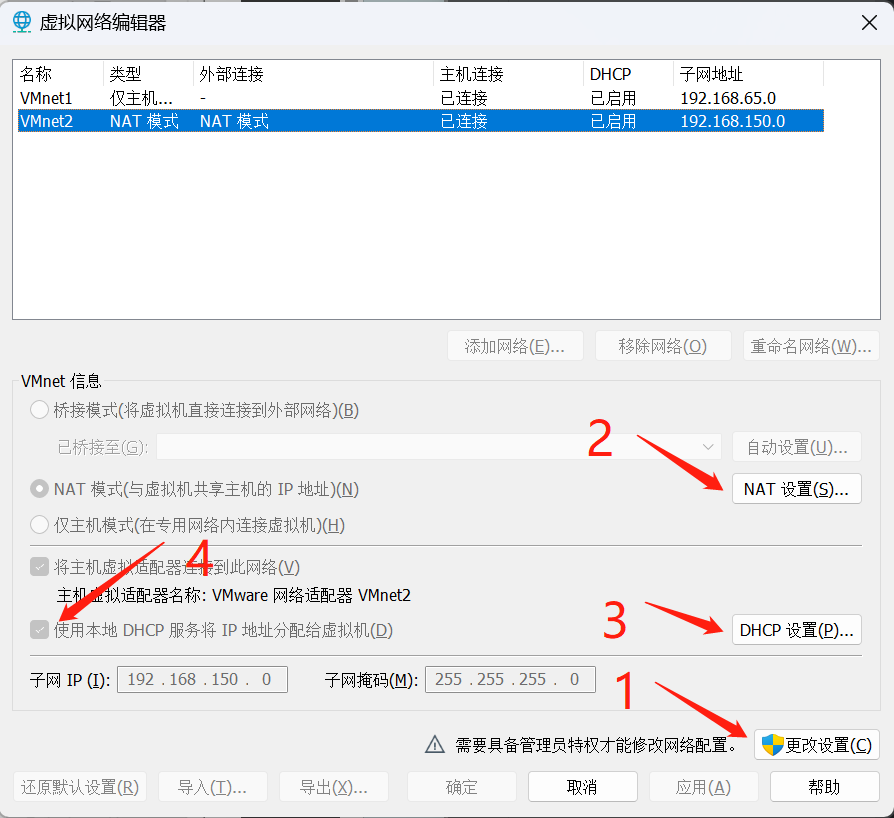
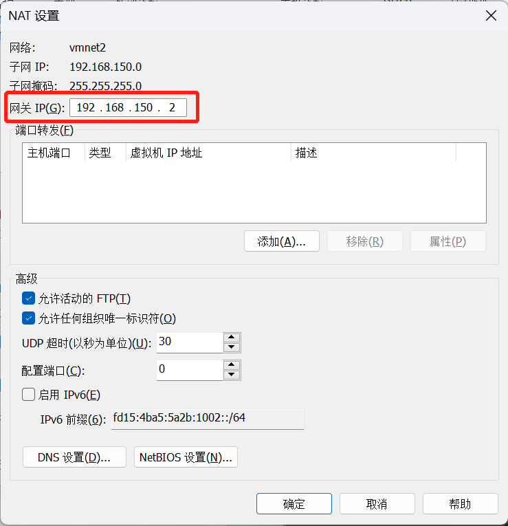
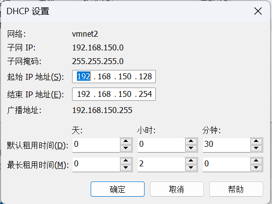
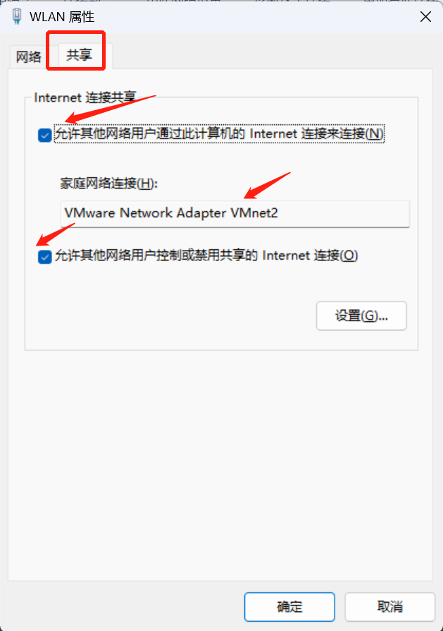
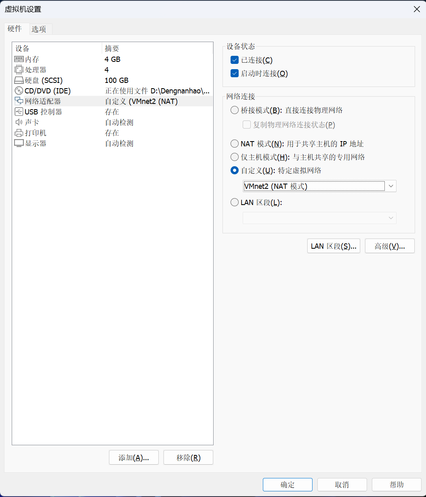
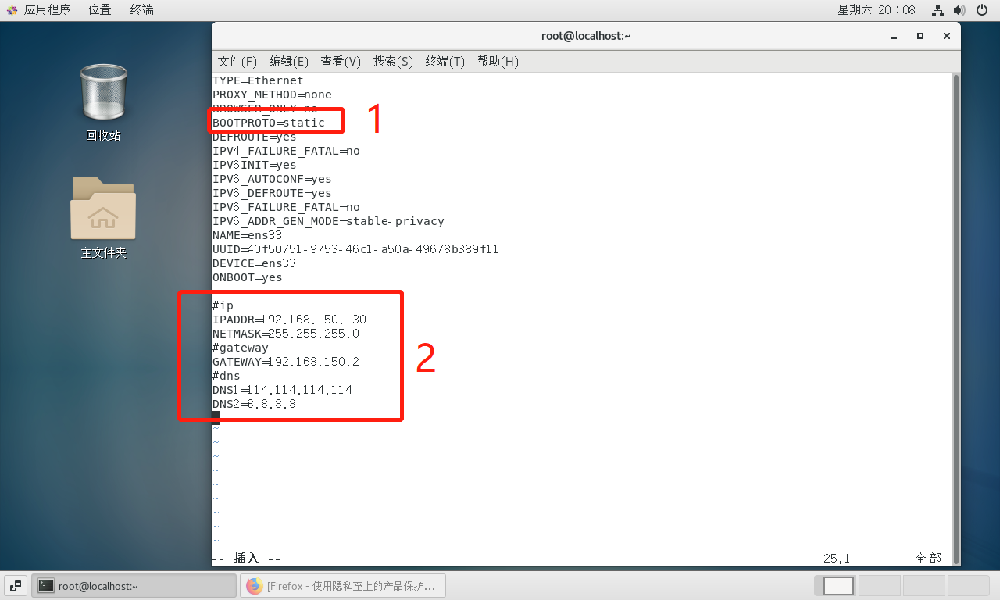

# VMware静态IP配置
本教程主要说明在windows虚拟机centos7.x系统上如何配置网络连接NAT模式

## 环境准备
- VMware-workstation-full-16.2.3-19376536
- CentOS-7-x86_64-DVD-2009.iso
- window11

## 详细配置

1. 在vmware中安装centos（自行安装），网络连接选择NAT模式。
2. vmware虚拟机网络设置
- 在window11中搜索【虚拟网络编辑器】



- 第一步：点击【更改设置】进入编辑模式，选择或者是【添加】虚拟网络

- 第二步：选择【NAT模式】，然后点击【NAT设置】记住【网关IP】，网关IP需要在子网IP段下



- 第三步：点击【DHCP设置】，记住【起始IP地址】、【结束IP地址】



- 第四步：勾选【使用本地DHCP服务将IP地址分配给虚拟机】

3. 配置宿主机的网络与VMnet2共享
- 设置位置【控制面板>网络和 Internet>网络连接】
- 右键点击宿主机网络选择【属性】，按下图设置



4. 右击虚拟机名称，选择【设置】更改【网络适配器】选择【自定义】中的VMnet2



5. 设置静态IP地址
- 打开虚拟机进入centos系统
- 配置网络
```bash
vim  /etc/sysconfig/network-scripts/ifcfg-ens33
```


- 设置`BOOTPROTO=static`
- 添加IP地址、网关和dns地址
```bash
#ip地址需要设置成【DHCP设置】中的【起始IP】和【终止IP】之间
IPADDR=192.168.150.130
NETMASK=255.255.255.0
#gateway 【NAT设置】中的网关IP
GATEWAY=192.168.150.2
#dns
DNS1=114.114.114.114
DNS2=8.8.8.8
```

6. 重启网络服务
```bash
systemctl restart network
```