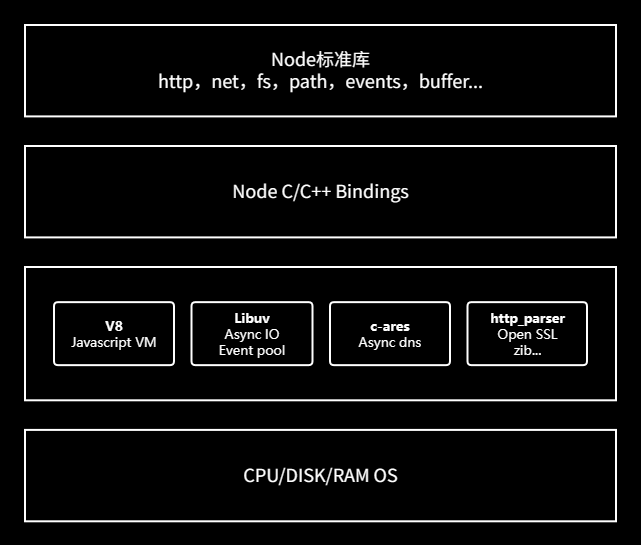

# Nodejs架构

## Natives modules
Natives modules 里面的内容全部是由js实现，提供了当前应用程序可以直接调用的库，例如：fs、path、http等；由于js语言无法操作底层的硬件设置，所以nodejs如何想和底层的硬件设备直接通信是需要一个桥梁；

## Builtin modules
Builtin modules(胶水层)，可以让nodejs的核心模块获取底层服务的支持。核心模块的功能的具体实现是由C/C++代码来实现。Builtin modules最主要的作用就是将js核心模块的A操作转换成具体的C/C++的操作。

## 底层
- V8:执行js代码，提供桥梁接口。将js调用的模块功能转化为C/C++所编写的函数，这个转换的过程就是由V8引擎来完成的。
- libuv：事件循环、事件队列、异步IO。